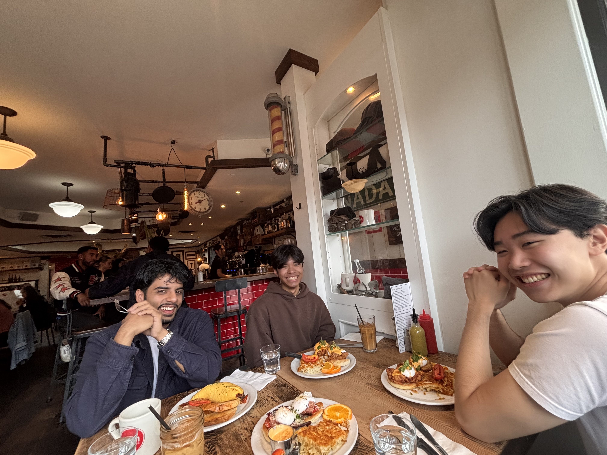

## Orientation Day!
For our masters program, we had three days for orientation where we are able to meet and connect with new people,
learn about the program, and do some fun activities. During orientation, I met some friends on the first day cause 
we had seating arrangements and I was placed between two cool people (Migs and Barry). The rest of the days
had ice breakers and you were able to talk to everyone even people in section 2 (Nitpreet). So all in all it was
a good orientation and start of the program.

## First Week of Classes!
The first week of classes were exciting, I feel like I had a lot of energy and motivation to stay on top of everything.
There was a lot of information to retain about setting up everything and the softwares we use for each class as
they differ and I have never used some of the platforms. I felt like the week was intense but still felt productive
and like I was starting to understand how things operate and what is expected

## What Surprised You!
I was definely surprised by how fast we get through the lectures and cover multiple topics. I think also liveliness
and amount of people on campus was different as I came from a smaller university. But everything is really nice on campus!

## How It's Going:
We are now almost at the end of week two and I am defintely feeling the stress and understanding what the accerated
part of an accerated masters program means. Next week, we have our exams so I'm starting to feel the stress of those assessments. It's been a long 3 days with trying to stay on top of the labs and making sure I am fully understanding every concept covered in class.

